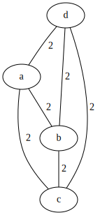
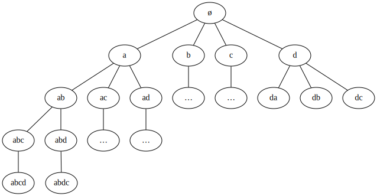
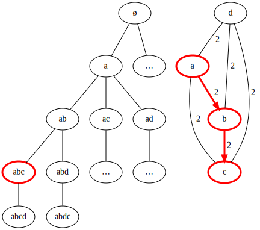

Solving the Travelling Salesman with A*
=======================================

Modeling the problem
--------------------

The travelling salesman is a well-known NP-Complete Problem, defined as :

> Given a list of cities and the distances between each pair of cities, what is the shortest possible route that visits each city exactly once and returns to the origin city?
> https://en.wikipedia.org/wiki/Travelling_salesman_problem

Here, we are asked to find and implement a solution to the problem using the A* Algorithm with different heuristics.

### The Problem Solving Graph

First, we'll define the structure a PSG ( Problem Solving Graph ) that represents our progression along the route we are going to take.

If the map of our cities looks like that :  

The corresponding PSG will be :  

And, for example, after taking the A → B → C path, we'll have:  

Implementing the data structures
--------------------------------
